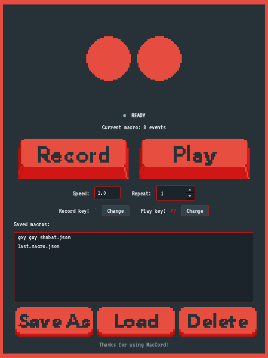

# MacCord — macOS Keyboard Macro Recorder

**MacCord** is a free, open-source **keyboard macro recorder and player for macOS** — a
lightweight **AutoHotkey / Keyboard Maestro–style automation tool for Mac**. Record your
key **presses and holds**, then **replay** them into any app with a **global hotkey**
(`F6` to record, `F7` to play). Built with Python + PySide6, with a custom pixel-art UI.

Great for **automating repetitive typing**, filling out forms, game macros, and chaining
keyboard shortcuts — record once, replay anywhere.



## Features

- 🎬 Records key **presses and holds** with exact timing (a 2s hold replays as 2s)
- ▶️ Replays into **any focused app** via a global hotkey
- ⌨️ **Rebindable hotkeys** (defaults: `F6` record, `F7` play) — change them in-app
- ⏩ Adjustable **playback speed** (0.25×–3×) and **repeat** (1–999)
- 🔁 **Loop indefinitely** until you stop it — tick "Loop ∞", press the play hotkey to start/stop
- 💾 **Save / load / delete** named macros
- 🎨 Custom pixel-art skin

---

## Run from source (works on any Mac)

You need **Python 3.9+**.

```bash
git clone https://github.com/ErosHabazaj/mac-macro-recorder.git
cd mac-macro-recorder
python3 -m venv .venv
source .venv/bin/activate
pip install -r requirements.txt
python macro_recorder_qt.py
```

> **Homebrew Python?** PySide6 installs fine via pip — no extra system packages
> needed (unlike Tkinter).

### Grant permissions (required)

macOS blocks reading and sending keystrokes until you allow it. Open
**System Settings → Privacy & Security** and add **the app you launch from**
(Terminal when running from source) to **both** lists, then quit & reopen it:

1. **Input Monitoring** — to *record* keys
2. **Accessibility** — to *replay* keys into other apps

---

## Usage

| Key | Action |
|-----|--------|
| `F6` | Start / stop recording |
| `F7` | Play into the focused app — press again to **stop** (also stops a loop) |

1. Press **F6**, type/hold keys in any app, press **F6** to stop (auto-saved).
2. Click into your target app, press **F7** to replay it there.
3. Click **Change** next to a hotkey to rebind it (saved to `settings.json`).
4. **Save As / Load / Delete** manage named macros, stored in a `macros/` folder.

Tick **Loop ∞** to replay continuously until you press the play hotkey again (or click Stop).

There's also a terminal-only version: `python macro_recorder.py`.

---

## Build it into a standalone `MacCord.app`

```bash
pip install pyinstaller
pyinstaller --noconfirm --clean --windowed \
  --name "MacCord" \
  --osx-bundle-identifier com.eroshabazaj.maccord \
  --icon MacCord.icns \
  --add-data "assets:assets" \
  --collect-all pynput \
  macro_recorder_qt.py
```

The bundle appears in `dist/MacCord.app` — drag it into `/Applications`. Grant
**Input Monitoring** and **Accessibility** to *MacCord.app* itself this time.

### ⚠️ Distributing the prebuilt app (Gatekeeper)

The build is **ad-hoc signed**, not notarized (notarizing needs a paid Apple
Developer ID). If someone **downloads** a prebuilt `.app` instead of building it,
macOS quarantines it and may say it *"can't be opened"* or *"is damaged."* To run it:

```bash
xattr -dr com.apple.quarantine "/Applications/MacCord.app"
```

…or right-click the app → **Open**. Building from source (above) avoids this
entirely. Prebuilt binaries are also tied to the build machine's CPU arch, so
**building from source is the recommended path for other users.**

---

## Customizing

- **Hotkeys / speed / lead-in:** the CONFIG block at the top of `macro_recorder.py`
- **The skin:** drop your own PNGs into `assets/` (sizes are documented in
  [`assets/SPEC.md`](assets/SPEC.md)). Pixel art is scaled ×3 nearest-neighbour.
- **The UI font:** replace `assets/font.ttf`

---

## Project layout

```
mac-macro-recorder/
├── macro_recorder_qt.py   # the GUI app (PySide6)
├── macro_recorder.py      # macro engine + optional terminal app
├── assets/                # pixel-art skin, VT323 font, asset spec
├── MacCord.icns           # app icon (used when building the .app)
├── requirements.txt
├── run.command            # double-click launcher (after the venv exists)
├── docs/screenshot.png
└── README.md
```

Recorded macros, the last recording, and `settings.json` are kept locally and
are **not** committed.

---

## Credits

- UI font: **[VT323](https://fonts.google.com/specimen/VT323)** by Peter Hull,
  licensed under the SIL Open Font License (see `assets/VT323-OFL.txt`).
- Built with [pynput](https://github.com/moses-palmer/pynput) and
  [PySide6](https://doc.qt.io/qtforpython/).
